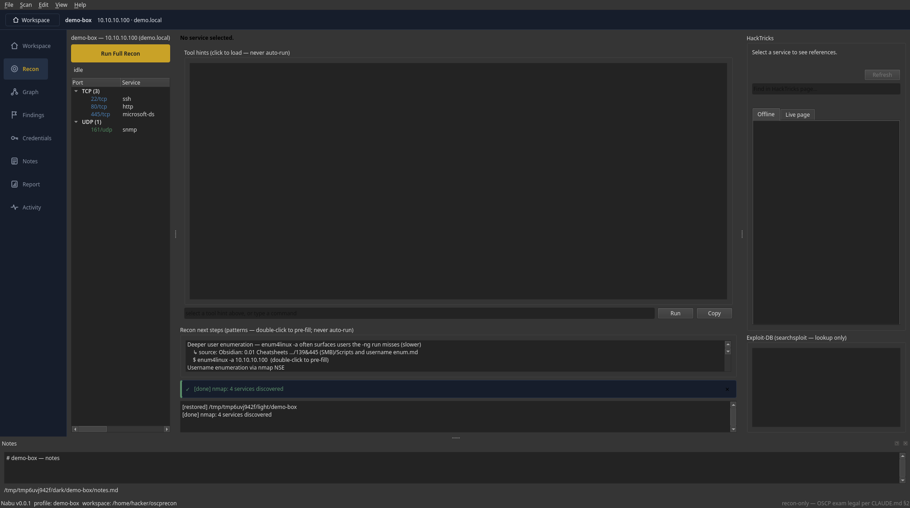

# Nabu — Local Recon Workspace

A **recon-first, OSCP-exam-legal desktop workspace** that orchestrates the standard enumeration
tools you already use (nmap, feroxbuster/gobuster/ffuf, nikto/whatweb, smbclient/netexec, …),
structures what they find, links each service to HackTricks and Exploit-DB, draws a BloodHound-style
attack-surface graph, and produces Obsidian-friendly reports. It runs **offline**, makes **no exploit
or LLM calls at runtime**, and is **strictly recon-only by default**.

*Internal package `oscprecon`; installs as `oscp-recon`; entry points `nabu` (GUI) and `nabu-cli` (headless).*



> **See it in action** (open these local HTML files in a browser):
> [`docs/nabu-demo.html`](docs/nabu-demo.html) — a 20-slide guided tour ·
> [`docs/how-nabu-works.html`](docs/how-nabu-works.html) — an interactive pipeline + system map ·
> [`docs/screenshots/`](docs/screenshots/) — the screenshot set ·
> [`docs/keyboard-shortcuts.md`](docs/keyboard-shortcuts.md) — shortcuts.

## Features at a glance

- **Staged nmap discovery** → a service tree (TCP top-1000 → full → UDP top-100 → versioned), with
  per-port nodes for non-standard HTTP/DB ports.
- **Per-service modules** with a tiered, safety-gated recon model — auto read-only checks, one-click
  default-credential checks, and opt-in (off-by-default) spraying.
- **Conservative findings** — an open port / version / Exploit-DB match is *never* called a
  vulnerability; only real weak postures (anonymous access, null session, SMB signing off) are flagged.
- **Reference pane** — vendored **offline** HackTricks + optional live copy, and `searchsploit`
  Exploit-DB lookup (linkout only — never fetched or run).
- **Attack-surface graph** (`Ctrl+G`), **credential vault** (masked, `0600`), **audit trail**, and an
  **Obsidian-ready `report.md`**.
- **Workspace dashboard** — searchable/filterable table of every project, with locking, health checks,
  and portable `<name>.tar.gz` import/export.
- **Light / dark theme**, offline splash, and a **diagnostics log** (Help → View Diagnostics Log).

## Quickstart

```bash
# 1. clone + set up (Python 3.11+ and uv required)
git clone https://github.com/7H35C4r3Cr0W/recon.git ~/oscp-recon && cd ~/oscp-recon
uv sync                 # create the venv and install deps
uv pip install -e .     # install the console scripts (nabu, nabu-cli + legacy aliases)

# 2. check the host has the wrapped tools (prints install hints for any that are missing)
nabu-cli doctor

# 3. launch
nabu                    # the GUI  (python -m oscprecon is equivalent)
```

On first launch Nabu creates its workspace at `~/oscprecon/` and opens to the Workspace dashboard.

## Requirements

- Python 3.11+ and [uv](https://docs.astral.sh/uv/).
- Kali Linux (or any host with the wrapped tools on `PATH`). Nabu never installs these — `nabu-cli
  doctor` reports which are missing. Install the common set on Kali:

  ```bash
  sudo apt update && sudo apt install -y \
    nmap feroxbuster gobuster ffuf dirsearch nikto whatweb wpscan \
    smbclient smbmap enum4linux-ng rpcclient impacket-scripts \
    netexec ldap-utils snmp onesixtyone dnsrecon dnsutils \
    ike-scan nbtscan ntpdate seclists exploitdb
  ```

  Or let Nabu offer to install the missing allow-listed tools for you (asks before each `apt`):
  `nabu-cli doctor --install`.

## Usage

### GUI

`nabu` launches the three-pane desktop app (service tree · command builder + output + follow-ups ·
HackTricks/Exploit-DB reference), plus the graph view (`Ctrl+G`) and the workspace dashboard
(`Ctrl+0`). Nothing runs itself — you click **Run** on every command, and each one is shown in full.

### CLI — a real example

The headless CLI (`nabu-cli`) is handy for scripting and quick scans. A scan streams nmap live and
writes everything into a self-contained project folder:

```console
$ nabu-cli scan 10.10.10.100 --profile htb-active
   {o,o}   Nabu — Local Recon Workspace
   |)__)   v0.0.1 · recon-only by default · OSCP exam-legal
   -"-"-   offline · no exploitation · no AI at runtime

[profile] /home/kali/oscprecon/htb-active  (scan profile: default)
PORT     STATE SERVICE       VERSION
22/tcp   open  ssh           OpenSSH 8.4p1
80/tcp   open  http          nginx 1.18.0
445/tcp  open  microsoft-ds  Windows Server 2019
161/udp  open  snmp
# → results saved under ~/oscprecon/htb-active/nmap/*.txt and recorded in profile.json
```

Reopen the same folder in the GUI (or `--resume` on the CLI) and the whole state comes back. Other
commands: `nabu-cli doctor` (host readiness), `nabu-cli export-vault` / `export-project` /
`import-project` (see `nabu-cli --help`).

**Scan profiles** — `quick` (top-1000 only), `default`, `full` (adds the slow full UDP sweep), or
`exam` (speed-tuned, tight, exam-legal — no vuln NSE). Pick one in Preferences, via `Scan → Run recon
with profile`, or `nabu-cli scan --scan-profile <name>`.

## What Nabu does

- **Discovery** — two-stage nmap (TCP top-1000 → full → UDP top-100, then a versioned `-sCV` pass on
  the open ports), parsed into a service tree. Non-standard HTTP/DB ports get their own per-port nodes
  and output folders.
- **Per-service modules** — HTTP (granular feroxbuster/gobuster/ffuf/dirsearch builder), vhost, SMB
  (tiered null/guest auto-recon), FTP, SSH, DNS, LDAP, SMTP, NFS, SNMP, TFTP, NetBIOS, IKE, NTP,
  **Kerberos/AD** (KDC confirm + enum-only AS-REP/SPN follow-ups, no cracking), and read-only DB modules
  (Redis, MongoDB, MSSQL, MySQL, PostgreSQL). Each ships Tier-1 auto recon, Tier-2 manual follow-ups, a
  parser, and pattern-library "recon next steps".
- **Findings & credentials** persist to `findings.json` / `creds.json` (mode `0600`); anonymous / null
  enum auto-records a credential entry that later modules consume.
- **Reports** — `report.md` (Obsidian-friendly frontmatter + callouts, prior versions archived) with a
  rendered report tab, an **Exploit-DB references** section (searchsploit EDB-IDs per service —
  lookup-only), and an **audit-trail appendix**. `File → Export to Obsidian Vault…` writes a linked
  note folder.
- **Resume** — `--resume` skips commands whose output already exists (`--force` re-runs).
- **Doctor** — `nabu-cli doctor` checks every wrapped tool on `PATH` and prints install hints.

### Reference pane (HackTricks + Exploit-DB)

For the selected service the reference pane offers three content tiers, most-reliable first:

1. **Vendored offline** — a build-time markdown snapshot (works with no internet), the reliable
   fallback; it jumps to the section matching your findings. CC BY-NC-SA — see
   [`src/oscprecon/references/hacktricks/NOTICE.md`](src/oscprecon/references/hacktricks/NOTICE.md).
2. **Live cached** — an owner-approved live fetch of the single canonical mapped page, cached under
   `~/.cache/oscprecon/` for later offline viewing. **OFF by default** (Preferences → References).
3. **Live page** — the canonical URL rendered live.

Live fetching is bounded: only the mapped page URL is requested (HTTPS, allow-listed host only), and
**your target IP, banners, findings, and credentials are never sent** — local context only chooses
which local sections to show. Exploit-DB stays `searchsploit` lookup + linkout only.

### Workspace dashboard

The home view (`Ctrl+0`, or shown on startup with no profile) is a searchable, filterable table of
every profile under the workspace root — built off the GUI thread, tolerant of corrupt/partial
profiles (they surface as ⚠ warning rows, never hidden). It shows target, status, tags, last activity,
and service/finding/**credential counts** (counts only — secret values never appear anywhere).

- **Organize** — per-profile status (new/active/needs-review/blocked/completed), tags, pin, and
  archive (archive hides by default and never deletes). Right-click for actions; bulk tag/status/
  archive/report/export/health across a selection.
- **Global search** — across names, targets, tags, services, ports, findings, notes, report headings,
  commands, and credential **usernames/domains**. Passwords/tokens/keys are never indexed or shown.
- **Saved views** — reusable filters (Pinned, Confirmed credentials, Missing a report, Failed scans,
  Windows, PostgreSQL, …) plus your own.
- **Health** — a read-only per-profile scan (corrupt/truncated JSON, stale temp files, orphaned
  output, world-readable creds, path escapes) with opt-in safe repairs that back up before changing.
- **Activity** — a human-readable timeline derived from the audit log (secrets redacted).
- **Locking & read-only** — opening a profile takes an advisory `<profile>/.lock`; a profile already
  open elsewhere offers **read-only** (title shows `[READ-ONLY]`, every write is blocked, export still
  works). Stale locks (dead PID, same host) are recovered automatically; live/foreign ones are never
  stolen.
- **Portable projects** — each profile folder is self-contained. `File → Open by IP…` finds a profile
  by its target IP; `Import Project…` / `Export Project…` move a profile between machines as a
  path-traversal-safe `<name>.tar.gz` (export **warns that `creds.json` is included**). Headless
  equivalents: `nabu-cli export-project` / `import-project`.

### Preferences

`File → Preferences…` (`Ctrl+,`) opens a tabbed settings dialog, persisted atomically to
`~/.config/oscprecon/prefs.json`:

- **Workspace** — workspace root (created on save if missing).
- **Appearance** — light/dark theme and an optional application font-size override (applied live).
- **Tool paths** — wordlist search paths (password lists are always filtered out and never shown).
- **Scan** — default scan profile (quick/default/full/exam) + opt-in full UDP port sweep (default
  stays UDP top-100).
- **Reports** — the fixed redaction/archiving guarantees, shown for reference.
- **Privacy** — the mandatory secret protections (§2), displayed locked-on; they cannot be disabled.
- **Performance** — cap on concurrent recon workers.
- **Advanced** — config-file location and *Reset all settings to defaults*.

Invalid values fall back to safe defaults; out-of-range numbers are clamped.

### Profile layout

Each box is a self-contained folder under the workspace root (default `~/oscprecon/`):

```
~/oscprecon/<name>/
├── profile.json          metadata · discovered services · command history
├── findings.json  creds.json (0600)  graph.json  notes.md  report.md
├── audit.jsonl           append-only GUI action log
└── nmap/ http/ smb/ …    per-service output folders
```

## Safety boundaries (OSCP exam-legal by default)

Recon-first, **exam-legal by default**. **No** exploitation, Metasploit, SQLMap, or LLM calls at
runtime — see [`CLAUDE.md`](CLAUDE.md) §2. Every command runs through one chokepoint (`shell.run` →
`policy_violation`) that refuses non-allow-listed tools, brute/spray flags, and file-write / OS-exec DB
primitives. By default the wordlist picker hides `Passwords/` and credential attempts are single-shot
Tier-2 actions the user clicks.

**Credential spraying** (hydra/medusa/netexec across SMB/WinRM/LDAP/SSH/FTP/RDP) is OSCP-legal against
your own authorized targets and is supported as an **explicit, opt-in, off-by-default** mode
(`Preferences → Scan → Enable Spray mode`; §2a). With it off, the tool is strictly recon-only. When on,
`Edit → Credential Vault…` manages the creds and `Scan → Credential Spray…` runs single-target sprays
from them.

## Troubleshooting

If the GUI or CLI misbehaves, Nabu writes a diagnostic log (crashes, errors, Qt warnings) to
`~/.local/state/oscprecon/logs/nabu.log`. Open it in-app via **Help → View Diagnostics Log…** (with
buttons to reveal the folder or clear it). On a CLI crash the log path is printed to stderr.

## Kali app menu / taskbar icon

```bash
cp packaging/nabu.desktop ~/.local/share/applications/
cp packaging/nabu.png ~/.local/share/icons/
update-desktop-database ~/.local/share/applications/
```

`Nabu` then appears under the Network/Security app menu (swap `Icon=` in the `.desktop` for your own).

## Development

```bash
uv run mypy --strict src/
uv run pytest -q                       # GUI tests use QT_QPA_PLATFORM=offscreen
uv run ruff check
uv run ruff format --check
```

## Docs & further reading

- [`CLAUDE.md`](CLAUDE.md) — the full project brief and hard constraints.
- [`ROADMAP.md`](ROADMAP.md) — the phase-by-phase build plan.
- [`PROJECT_MAP.md`](PROJECT_MAP.md) — subsystem-by-subsystem status map and forward plan.
- [`PROGRESS.md`](PROGRESS.md) — the detailed build log.

## License

MIT — see [`pyproject.toml`](pyproject.toml). Bundled HackTricks content is CC BY-NC-SA; see the
[NOTICE](src/oscprecon/references/hacktricks/NOTICE.md).
