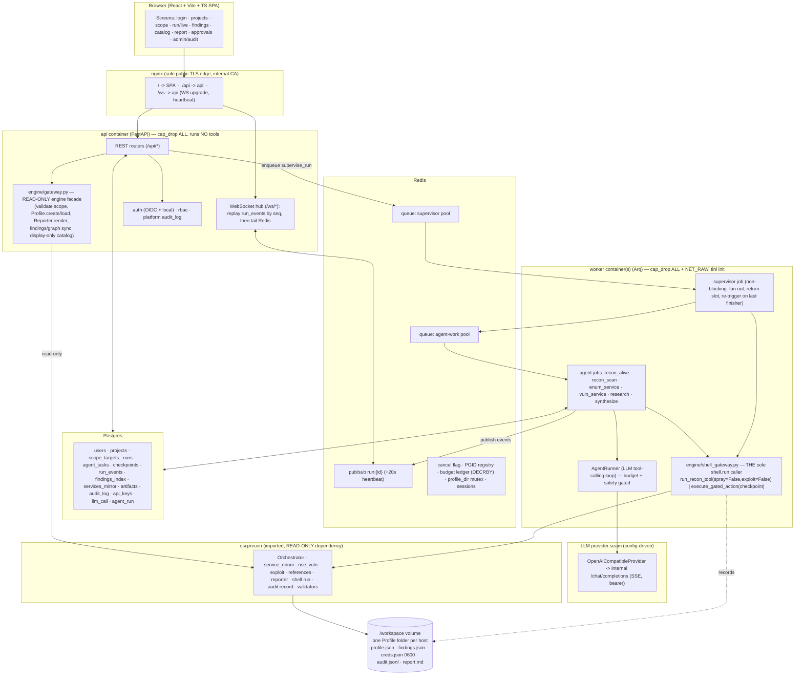
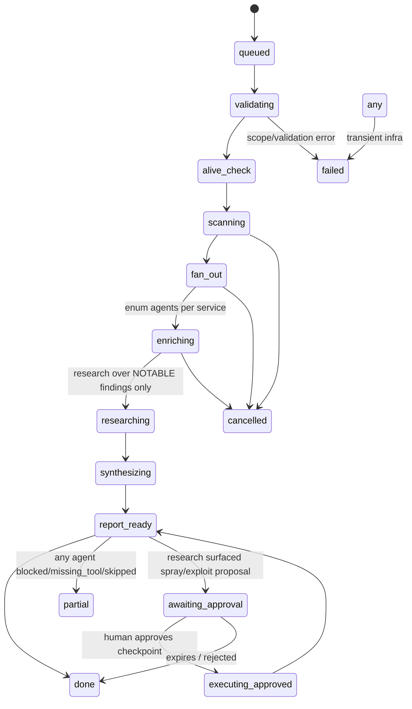

# Nabu Agent — DESIGN.md

## 1. Overview

Nabu Agent is an internally-hosted, browser-based multi-agent front end for the classic **Nabu** recon engine (`oscprecon`). It turns the desktop tool's single-operator workflow into a team platform: an operator logs in, creates a scoped engagement project, launches an autonomous recon run, watches a live agent-task tree stream to the browser, and reads a grounded report — while every attack action (spray/exploit) stays behind an explicit human gate.

The engine is consumed **as a read-only imported library**. Nabu Agent never modifies `src/oscprecon`, never re-implements its tool allow-list, and routes every tool execution through the engine's own `oscprecon.shell.run`. The platform is the **body**; the engine is the **hands**; an OpenAI-compatible LLM endpoint is the swappable **brain**.

### The six non-negotiables (carried over from classic Nabu, enforced structurally)

1. **`src/oscprecon` is read-only** — non-editable path dependency; a CI hygiene job fails any PR that diffs the engine tree.
2. **A single `shell.run` chokepoint** — exactly one module imports and calls `oscprecon.shell.run`.
3. **Authorized-scope-only** — every target is validated by the engine's own validators *and* confirmed a member of the project's scope allowlist before any tool runs.
4. **No blind auto-exploit / double-gated spray** — recon is automated; spray/exploit require a per-project toggle **plus** a human-approved checkpoint. `exploit=True` lives in exactly one human-gated executor and is unreachable from any agent path.
5. **Swappable OpenAI-compatible LLM seam** — provider/base_url/api_key/model come from config; no vendor SDK coupling, no hardcoded endpoint.
6. **Recon automated, attack human-gated** — `awaiting_approval` is the only human branch in the run state machine.

## 2. The brain / body split

| Layer | Role | Trust |
|---|---|---|
| **Brain** | The LLM (default GPT-5.1 over an internal OpenAI-compatible endpoint). Plans, chooses tools, writes prose. | Untrusted planner. Its tool calls are validated and safety-gated before dispatch. Its prose is grounded against engine artifacts before it reaches an operator. |
| **Body** | Nabu Agent — FastAPI edge, Arq orchestration, the engine adapter, Postgres/Redis. Owns state, scope, gates, audit. | The enforcement boundary. Safety is code here, not prompt text. |
| **Hands** | `oscprecon` — the imported recon engine and its allow-listed tools. | Read-only dependency; the sole executor of tools via `shell.run`. |

**Enforcement is code, not prompt.** The system prompt's safety preamble (authorized-scope-only, never propose blind exploit, cite sources, say "unknown" rather than fabricate) is defense-in-depth. The hard backstops are: the exploit flag is never exposed as a tool parameter; the scope check is a single code function; spray/exploit require a Postgres-verified approved checkpoint.

## 3. Architecture diagram



## 4. Component breakdown by layer

All code lives under one package root: **`nabu-agent/nabu_agent/`** (the `backend/app/` and `src/nabu_agent/` trees from sibling drafts are merged into it; see §12). `docker-compose` runs `uvicorn nabu_agent.main:app` and `arq nabu_agent.worker.WorkerSettings`.

### 4.1 Web platform (`nabu_agent/` edge)
- **`main.py`** — app factory, middleware chain (RequestID → session-resolve → audit-context → CSRF for unsafe methods), router mount under `/api`, `/ws` mount, lifespan (async SQLAlchemy pool + Redis pool, headless engine-import check asserting no PySide6, `/workspace` writable check). Same-origin only; CORS off.
- **`settings.py`** — single root `Settings` (pydantic-settings, `NABU_` prefix) composing an `LLMSettings` sub-model (`NABU_LLM_` prefix). DB/Redis URLs, workspace root, session/cookie/CSRF, OIDC config, default scan profile, gate defaults (recon-only).
- **`auth/`** — `AuthProvider` protocol; `OIDCProvider` (Authlib authorization-code, JIT provisioning keyed on issuer+subject, first-user→admin); `LocalProvider` (argon2). Redis-backed opaque sessions in an httpOnly `SameSite=strict` `Secure` cookie; the WebSocket reuses the same cookie at handshake (no token-in-URL). Bearer API keys/JWT for machine clients.
- **`rbac.py`** — global `Role` (admin/operator/viewer) + per-project `ProjectRole`; one static `PERMISSIONS` capability matrix; `can(role, perm)`. Spray/exploit run creation additionally requires the project toggle + approved checkpoint (enforced in the runs service).
- **`audit.py`** — platform `audit_log` writer (who-did-what-in-the-app), **distinct** from the engine's per-project `audit.jsonl` (what-ran). Records login/logout/failures, project/scope/settings/member changes, run start/cancel, checkpoint decisions, downloads, and every denied authorization.
- **`engine/gateway.py`** — the **only** module the api process uses to touch `oscprecon`; all calls read-only or profile-creation (never tool execution). Serializes engine dataclasses to DTOs so the HTTP layer never emits an engine object.
- **`routers/`** — auth, users, projects, scope, runs, findings, catalog, reports, creds, audit, settings, health.
- **`ws/hub.py` + `ws/routes.py`** — cookie-auth handshake, project-read RBAC, replay `run_events` by `seq`, then tail Redis `run:{id}`; server-side coalescing of high-frequency events (~250 ms batches) + a ~20 s heartbeat decoupled from scan output.
- **`bus.py`** — the single Redis interaction surface: enqueue, cancel-flag set/get, typed publish/subscribe.

### 4.2 Orchestration (`nabu_agent/orchestration/`)
- **`states.py`** — `RunState(StrEnum)` {queued, validating, alive_check, scanning, fan_out, enriching, researching, synthesizing, report_ready, awaiting_approval, executing_approved, done, partial, failed, cancelled}; `TERMINAL`; `can_transition(src, dst)`. Recon states automated; `awaiting_approval` is the only human gate.
- **`tasks.py`** — the agent graph as Arq jobs. `supervise_run` is **non-blocking**: it fans out child jobs then returns its worker slot; the state machine advances via a **re-trigger-on-last-finisher barrier** (Redis `DECR` fan-in counter; the last child re-enqueues `supervise_run`). Child jobs: `recon_alive`, `recon_scan`, `enum_service`, `vuln_service`, `research_service`, `synthesize_report`. `execute_approved_action` is the separate human-gated attack path.
- **`blackboard.py`** — two-layer shared state over the Profile folder. `ReadBlackboard` (services/findings + `write_findings` — fcntl-safe) and `WriteBlackboard` (profile.json mutations, supervisor-only). `ServiceDelta`/`CredentialDelta` message shapes bridged over Redis.
- **`limits.py`** — `RunLimits` with `from_settings(max_concurrency, ...)` clamping concurrent service agents to the engine's `Settings.max_concurrency`; caps for hosts/run, per-host enum, per-agent + per-run token/step/wall-clock, **and a hard `max_total_tasks` per run** (hosts × services).
- **`checkpoints.py`** — `Checkpoint` + `CheckpointKind{spray,exploit}`/`CheckpointStatus`; `approve(cp, operator, spray_enabled)` enforcing the double gate; the sole carrier of `exploit_confirmed`.
- **`worker.py`** — top-level `nabu_agent/worker.py` exposes `WorkerSettings`. **Two queues / two pools**: a supervisor pool and an agent-work pool, so awaiting supervisors can never starve their children. Per-scan-profile `job_timeout`, retry classification (`is_retryable` — blocked/missing_tool never retried), and idempotency (skip re-exec if a prior attempt recorded `shell_outcome==ok`).
- **`admission.py`** — global concurrent-run ceiling + **one active run per project** (Postgres partial-unique index on `runs(project_id) WHERE state NOT IN terminal` + a Redis mutex on `profile_dir` held for the run lifetime; this also prevents a retry double-supervisor).

### 4.3 Engine adapter (`nabu_agent/engine/`)
- **`__init__.py`** — public surface + `TOOLS` registry (`ToolSpec{name, fn, executes, mutates, summary}`) advertised to the tool-call layer and gating UI. No exploit/spray tool registered.
- **`tools.py`** — the eight typed agent tools returning JSON dicts: `check_alive`, `run_scan`, `list_discovered_services`, `enum_service`, `catalog_actions_for` (display-only, stateless), `research_finding`, `suggest_next_steps`, `generate_report`. Recon tools execute only via the chokepoint.
- **`shell_gateway.py`** — **THE single chokepoint** (see §10). Sole importer/caller of `oscprecon.shell.run`. Exposes `run_recon_tool(...)` (spray/exploit hard-wired False, no param to raise) and `execute_gated_action(checkpoint, ...)` (the only place `exploit=True`/`spray=True` can be set, after Postgres-verifying an approved, human-decided checkpoint). Also `assert_in_scope`, `raise_for_result`, `audit`.
- **`workspace.py`** — maps a project GUID (+ authoritative scope from Postgres) to Profile folder(s) under the workspace root. **For a CIDR/multi-host scope, one Profile per live host** (namespacing findings so the host-less `findings._key` cannot collide across hosts — see §5). Keeps `profile.target.ip` equal to the assigned scope.
- **`schemas.py`** — TypedDict I/O contracts (`ServiceDTO`, `ShellResultDTO`, `CatalogActionDTO`) + converters (`to_service_dto`, `to_shell_dto`). Notes `DiscoveredService.port` vs `Port.number`.
- **`errors.py`** — stable codes: `EngineAdapterError`, `ProjectNotFound`, `ScopeViolation`, `InvalidTarget`, `ToolBlocked`, `ToolMissing`, `ReadOnlyProject`, `AttackGateClosed`.
- **`settings.py`** — env-driven adapter config (workspace root, tool timeout default, HackTricks-live opt-in).

### 4.4 Brain seam (`nabu_agent/llm/`, `nabu_agent/agents/`, `nabu_agent/events/`)
- **`llm/base.py`** — `LLMProvider` Protocol (`chat`, `stream`, `count_tokens`, `model`) + wire dataclasses (`Message`, `ToolCall`, `ToolSpec`, `ChatRequest/Response`, `ChatChunk`, `Usage`, enums). Pure schema, no I/O.
- **`llm/openai_compat.py`** — default adapter: `POST {base_url}/chat/completions`, bearer auth, tool schemas, SSE streaming with tool_call delta reassembly by index.
- **`llm/config.py` (`LLMSettings`) + `llm/factory.py` (`build_provider`)** — connection/tuning from `NABU_LLM_*`; provider-name registry; shared `httpx.AsyncClient`.
- **`llm/retry.py`** — exponential backoff + jitter, `Retry-After`-aware, retriable-vs-fatal classification. **A turn with committed tool side-effects is never replayed.**
- **`agents/runner.py`** — `AgentRunner`: assemble → call provider (streaming to bus) → on `tool_calls` validate against `ToolRegistry` → `SafetyGate.check` → dispatch via the engine chokepoint → append tool result → repeat, bounded by `AgentBudget`.
- **`agents/roles.py` + `agents/prompts/*.j2`** — role registry (planner, enum_writer, research, reporter), allowed-tool subsets, budgets, shared `SAFETY_PREAMBLE`.
- **`agents/context.py`** — `ContextAssembler` builds the read-only context bundle from the engine and `budget_fit`-truncates by severity/score; **research fans out only over notable findings** (`finding_severity.is_notable`), and `nmap_scripts_output` is summarized, not dumped.
- **`agents/safety.py`** — `SafetyGate`: per-role tool allowlist; absolute exploit ban (any `exploit`-shaped argument → BLOCK); scope validation delegated to the single `shell_gateway.assert_in_scope`; spray double-gate → `needs_approval`.
- **`agents/budget.py`** — `BudgetStore` with **atomic run-level reservation** (Redis `DECRBY` reserve-before-start) plus per-agent step/token/wall-clock ceilings.
- **`events/schema.py`** — the **one canonical event envelope** (see §6).
- **`agents/report_grounding.py`** — post-generation validator that rejects/flags any report claim not backed by an engine artifact id (CVE not in `edb.json`, credential not in `creds.json`, port not in `discovered_services`).

### 4.5 Deploy / security / ops (`nabu-agent/deploy/`, root)
- **`docker-compose.yml`** — five services: `frontend` (nginx, sole public TLS edge), `api` (cap_drop ALL, 127.0.0.1:8000), `worker` (cap_drop ALL + cap_add NET_RAW, `no-new-privileges`, seccomp, `init: true`/tini, `replicas`), `postgres:16`, `redis:7`; `backend` network `internal: true`, isolated `egress` bridge for workers; named volumes; a one-shot **`migrate`** service running `alembic upgrade head` gated on postgres-healthy.
- **`deploy/Dockerfile.api`** — Kali-based headless image (no Qt), recon allow-list toolset, `src/oscprecon` copied read-only, agent installed via path-dep, `setcap cap_net_raw+ep` on the real nmap binary, non-root uid 10001, `WITH_ATTACK=0` build arg gating attack tools. Shared by api and worker (command differs).
- **`deploy/Dockerfile.frontend` + `deploy/nginx.conf`** — Vite build → nginx; reverse-proxy `/api` and `/ws` (Upgrade headers, long read timeout) + SPA fallback + HSTS/X-Content-Type-Options/X-Frame-Options.
- **`deploy/seccomp/worker.json`** — docker-default minus syscalls recon never needs (mount, ptrace, kexec, module load, bpf, reboot). CI materializes the effective profile.
- **`obs/logging.py`** — structlog JSON keyed by run_id/agent_id; the two-audit-trail doctrine + logs as a third non-authoritative diagnostic stream; OpenTelemetry run/agent traces.

## 5. Postgres data model

Postgres holds **product + orchestration state and read models**; the oscprecon Profile folder(s) on `/workspace` remain authoritative recon truth.

**Platform tables**
- **`users`** — id uuid pk; email citext unique; display_name; role; auth_source(oidc|local); password_hash (argon2, local only); oidc_issuer/oidc_subject (unique together); is_active; timestamps; last_login_at.
- **`api_keys`** — id; user_id fk; name; token_hash (sha256); scopes text[]; expires_at; last_used_at; revoked_at.
- **`projects`** — id; slug unique; display_name; owner_id fk; engine_profile_dir (under workspace_root); status(active|archived); scan_profile(quick|default|exam|full); spray_enabled bool default **false**; exploit_enabled bool default **false**; timestamps. Maps to a Profile folder (or, for CIDR, a parent dir holding per-host child Profiles).
- **`project_members`** — (project_id, user_id) pk; role(owner|operator|viewer).
- **`scope_targets`** (the scope-lock allowlist) — id; project_id fk; target (IP or CIDR, validated via `models.validate_host_or_range` before insert); kind(host|range); is_entry bool; source(manual|promoted-pivot); added_by; UNIQUE(project_id, target). A discovered pivot must be **explicitly promoted** here (human-gated) before any run may target it.

**Orchestration tables**
- **`runs`** — id; project_id fk; kind(scan|enum|vuln|spray|exploit); target (must be authorized by the scope function against `scope_targets`); params jsonb; state (mirrors `RunState`); limits jsonb; llm_tokens_used int; requested_by; arq_job_id; cancel_requested bool; summary jsonb; error text; started/updated/finished_at. **Partial-unique index on (project_id) WHERE state NOT IN terminal** enforces one active run per project.
- **`agent_tasks`** — id; run_id fk; parent_task_id fk self (fan-out tree); role(recon|enum|vuln|research|writer|attack); host/port/proto/service; state(queued|running|done|failed|skipped|blocked|cancelled); shell_outcome(ok|blocked|missing_tool|cancelled|timeout|error); idempotency_key text; shell_result jsonb (ShellResultDTO); engine_command_id; output_file; attempts int; llm_tokens_used; timestamps.
- **`checkpoints`** (the only human gate) — id; run_id fk; task_id fk; kind(spray|exploit); status(proposed|approved|rejected|executed|expired); target; action_id; rationale; requires jsonb; credential_ref; exploit_confirmed bool; approved_by fk; approved_at. A gated action executes **only** for a checkpoint with status=approved and a non-null human `approved_by`.
- **`run_events`** (durable, seq-ordered replay feed; distinct from `audit.jsonl`) — id bigserial; run_id fk; seq int (per-run monotonic); ts; type; task_id; payload jsonb. **Secrets are stripped/hashed here — payloads carry `credential_ref`, never cleartext.**
- **`findings_index`** — read model of `findings.json`; id; project_id; run_id; host; engine_key; module/kind/value/detail; port/proto; category (`finding_severity.category_of`); rank; is_manual; UNIQUE(project_id, host, engine_key).
- **`services_mirror`** — read model of `discovered_services`; UNIQUE(project_id, host, port, proto).
- **`artifacts`** — id; project_id; run_id; kind(report_md|graph_json|vault_export|project_export|output_file); path; filename; content_type; size_bytes; sha256; generated_by; created_at.
- **`audit_log`** (platform who-did-what) — id bigserial; ts; actor_user_id; actor_ip inet; action (kebab slug); object_type/object_id; project_id; result(success|denied|error); details jsonb; request_id.
- **`llm_call`** — id; run_id; agent_id; role; provider; model; prompt/completion/total_tokens; finish_reason; latency_ms; retries; http_status; error; created_at. **Raw tool output is not persisted verbatim; secrets stripped.**
- **`agent_run`** — agent_id pk; run_id; role; profile_dir; status; steps; tokens_used; stopped_reason; timestamps.

Migrations are Alembic (`alembic upgrade head` via the one-shot `migrate` service before api serves). A `python -m nabu_agent.bootstrap` seeds the first local admin and default settings when OIDC is off.

## 6. REST + WebSocket API surface

### 6.1 One canonical WebSocket event envelope
Defined once in `nabu_agent/events/schema.py`, imported by every publisher and consumer:

```
Event {
  type: RunEventType,      # single superset enum (below)
  run_id: str,             # mandatory
  seq: int,                # mandatory, per-run monotonic (for replay)
  ts: float,               # mandatory
  agent_id: str | None,
  task_id: str | None,
  data: dict               # type-specific payload (secrets redacted; cred_ref only)
}
RunEventType = run.status | task.created | task.updated | log.line
             | finding.added | usage | checkpoint.requested | checkpoint.decided
             | approval.required | heartbeat | error | done
```
Client→server ops are limited to `{op: "ping"}` and `{op: "approve"|"reject", checkpoint_id, note}`. All other mutations go through REST.

- `GET /ws/runs/{run_id}` — cookie-auth handshake, project-read RBAC, replay `run_events` by seq, then tail Redis `run:{run_id}`; server emits a `heartbeat` every ~20 s regardless of scan output; `task.updated`/`log.line` coalesced ~250 ms.
- `GET /ws/projects/{id}` — project-level deltas (new runs, finding counts).

### 6.2 REST (behind nginx `/api/`)
- **Auth**: `GET /auth/providers`; `POST /auth/login`; `GET /auth/oidc/login`; `GET /auth/oidc/callback`; `POST /auth/logout`; `GET /auth/me`; `POST /auth/refresh`.
- **Users (admin)**: `GET|POST /users`; `GET|PATCH|DELETE /users/{id}`; `POST|GET|DELETE /users/{id}/api-keys`.
- **Projects**: `GET|POST /projects` (create calls `Profile.create`); `GET|PATCH|DELETE /projects/{id}`; `GET|POST|PATCH|DELETE /projects/{id}/members`; `GET|PATCH /projects/{id}/settings` (spray_enabled/exploit_enabled/scan_profile — admin).
- **Scope**: `GET|POST /projects/{id}/scope`; `DELETE /projects/{id}/scope/{target_id}`; `POST /projects/{id}/scope/promote` (human-gated pivot promotion).
- **Runs**: `GET|POST /projects/{id}/runs` (validate scope + RBAC + gating + enqueue `supervise_run`); `GET /runs/{rid}`; `GET /runs/{rid}/tasks`; `POST /runs/{rid}/cancel`; `GET /runs/{rid}/tasks/{tid}/output`.
- **Checkpoints**: `GET /projects/{id}/checkpoints?status=pending`; `POST /projects/{id}/checkpoints/{cid}/decision` (approve|reject; `Perm.CHECKPOINT_DECIDE`; approve unlocks the gated action).
- **Findings/services/graph**: `GET|POST /projects/{id}/findings`; `PATCH|DELETE /projects/{id}/findings/{fid}` (manual only); `GET /projects/{id}/services`; `GET /projects/{id}/graph`.
- **Catalog/suggestions (display-only, never executes)**: `GET /projects/{id}/suggestions`; `GET /projects/{id}/catalog`; `GET /catalog/services/{key}`.
- **Reports/artifacts/creds/exports**: `GET /projects/{id}/report` (`Reporter.render`, no side effects); `POST /projects/{id}/report` (worker-side `Reporter.write`); `GET /projects/{id}/artifacts`; `GET /artifacts/{aid}/download` (RBAC + audit, `no-store`); `POST /projects/{id}/export`; `GET|POST|DELETE /projects/{id}/credentials` (gated + audited).
- **Audit/activity/settings/health**: `GET /audit`; `GET /projects/{id}/activity` (engine `audit.load_entries`); `GET|PATCH /settings`; `GET /health`; `GET /health/ready` (DB+Redis+engine-import+workspace); `GET /llm/health`; `GET /runs/{rid}/usage`.

### 6.3 Error contract
One envelope, one registered FastAPI exception handler mapping every `EngineAdapterError`/`SafetyViolation` code to an HTTP status:

| Code | Status |
|---|---|
| `InvalidTarget` | 422 |
| `ScopeViolation` | 403 |
| `AttackGateClosed` / `AutonomyViolation` | 403 |
| `ToolBlocked` | 409 |
| `ToolMissing` | 409 |
| `ReadOnlyProject` | 409 |
| `ProjectNotFound` | 404 |

Body shape: `{ "code": str, "message": str, "request_id": str, "details": {...} }`. Validation errors reuse FastAPI's 422 wrapped in the same envelope.

## 7. Agent graph + run state machine



- The **supervisor** (`supervise_run`) is a non-blocking Arq job on the supervisor pool. It runs the entry-host scan inside its held single-writer profile lock (via `Orchestrator.run_nmap`), enqueues child agents onto the agent-work pool, then **returns its slot**. A Redis fan-in counter (`DECR`) drives a re-trigger barrier: the last finishing child re-enqueues `supervise_run`, which advances the state machine.
- **Recon path is fully automated.** `awaiting_approval`/`executing_approved` is the only human branch; the recon pipeline never enters it on its own — only the research/writer agents can surface a `Checkpoint` proposal.
- **Partial-failure is first-class**: a blocked/missing_tool/skipped agent marks its `agent_task` row and never fails the run; the run ends `partial` and the writer notes the gap.

## 8. LLM provider seam + config

- **Contract**: 4-method `LLMProvider` Protocol; default `OpenAICompatibleProvider` speaks OpenAI Chat Completions + tool-calling over a shared `httpx.AsyncClient` (SSE streaming). `build_provider(settings)` dispatches on `settings.provider` (unknown → ValueError). No vendor SDK dependency.
- **Config (single owner, `LLMSettings`, `NABU_LLM_*`)**: `provider` (default `openai_compatible`), `base_url` (required), `api_key` (SecretStr, from secret store), `model` (default `gpt-5.1`), `temperature`, `top_p`, `max_output_tokens`, `context_window`, `stream`, `timeout_connect_s/read_s/total_s`, `max_retries`, `backoff_base_s/max_s`, `tls_verify`, `ca_bundle`, `extra_headers`, `organization`. The platform `Settings` **references** this sub-model — it does not redeclare the fields.
- **Loop reliability**: layered httpx timeouts; tenacity-style backoff with jitter honoring `Retry-After` on 429/5xx/network; **retries apply to the LLM HTTP call only — once a tool has been dispatched in a step, the turn is never replayed** (prevents double-running a scan).
- **Budgets**: per-agent step/token/wall-clock ceilings **plus** an atomic run-level token reservation (`DECRBY` before an agent starts). If usage is absent from a streamed response, fall back to `count_tokens` and flag the run as estimated.
- **Grounding**: context is assembled from the engine (`discovered_services`, `findings.load_findings` ranked by `finding_severity`, `exploit.services_present`/`suggested_action_ids`, `references.match`/`hacktricks`) — never re-derived. The report-grounding validator (§4.4) is the hard backstop behind "cite your sources."

## 9. Safety posture (carried over from classic Nabu)

1. **Read-only engine** — non-editable path dependency; CI hygiene job fails any PR diffing `src/oscprecon`; only `nabu_agent.engine.*` imports the engine; a smoke test asserts PySide6 is never imported (headless).
2. **Single chokepoint** — `nabu_agent/engine/shell_gateway.py` is the sole importer/caller of `oscprecon.shell.run`. The AST invariant asserts (a) no `subprocess`/`os.system`/`shell=True` anywhere in the agent source, (b) `shell.run` is called only from that module, (c) its SRC root exists and is non-empty (a scan of a missing dir must not pass vacuously).
3. **Scope authorization** — one function (`shell_gateway.assert_in_scope`) validates format via `models.validate_host`/`validate_host_or_range`/`nmap_scan.validate_scan_target` **and** confirms membership against the full `scope_targets` allowlist (exact host, host inside an in-scope CIDR, or a promoted row) — not equality to a single `profile.target.ip`. Enforced at the API before enqueue and re-checked in the worker; **each fanned-out host in a CIDR run is re-validated** before its scan/enum (parse_alive output is attacker-influenceable). `SafetyGate` delegates to this same function — no second implementation.
4. **No blind auto-exploit / double-gated spray** — `run_recon_tool` hard-wires `spray=False, exploit=False` with no parameter to raise them (matching the engine, where `policy_violation` returns `None` immediately on `exploit=True` — a full allow-list bypass, hence made unreachable). Agent fan-out only ever creates recon/enum/vuln tasks. Spray/exploit require: (a) per-project `spray_enabled`/`exploit_enabled` in Postgres, (b) operator/admin RBAC, and (c) a `checkpoint` row with status=approved and a human `approved_by`. **`exploit=True`/`spray=True` are set in exactly one place — `execute_gated_action` — sourced only from a Postgres-verified approved checkpoint id (server-minted, non-forgeable, never passed through the LLM/agent layer).** The gate source of truth is the Postgres flag + approved checkpoint **only**; the engine's app-wide `config.exploit_enabled()` (which defaults **True** — a documented landmine) is **never** consulted to authorize execution. An invariant test asserts this.
5. **Two distinct audit trails** — engine `audit.jsonl` (what ran, per project, via `audit.record`, best-effort, never gates logic) and Postgres `audit_log` (who did what in the app). A gated action is recorded on first successful execution keyed by its idempotency key.
6. **Least privilege + isolation** — api drops ALL caps and runs no tools; worker drops ALL, re-adds only NET_RAW under `no-new-privileges` + seccomp; internal-only backend network; isolated egress net; non-root uid 10001; nginx the sole public TLS edge.
7. **Secrets at the new networked boundaries** — owner policy ships secrets un-redacted on disk, but Nabu Agent **strips/hashes secrets from `run_events`, `llm_call`, and WS envelopes** (carrying `credential_ref` only); the real secret is fetched only in the worker via `ReconAuth.from_credential` at execution time. `creds.json` (0600)/`audit.jsonl` remain the sensitive-at-rest store on an access-controlled, ideally encrypted volume; downloads stream `no-store`.
8. **Report grounding** — the report is built from engine artifacts (`discovered_services`, `findings.json` via `from_parsed`, `patterns.engine.suggest_for`); the grounding validator rejects/flags any claim not backed by an artifact id; AI-narrative sections are visually delimited so operators never mistake synthesis for ground truth.

## 10. The single `shell.run` chokepoint (reconciliation detail)

The prior drafts named four call sites (`guard.run_tool`, `ToolDispatcher`, `tool_gateway.run_tool`, a direct attack executor) and an AST test that both required `exploit=True` "nowhere" and expected an approved exploit to run. These are reconciled into **one module**, `nabu_agent/engine/shell_gateway.py`:

- It is the **only** module that imports `oscprecon.shell.run`.
- `run_recon_tool(...)` — reachable by agents and the `ToolDispatcher`; `spray`/`exploit` hard-wired False, no parameter to raise them. All recon/enum/vuln execution funnels here (the engine's `Orchestrator` and `service_enum` engines already route their commands through `shell.run`). It mandates a per-step `shell.run(timeout=)` so the engine's own `threading.Timer` `killpg` fires independently of orchestration liveness.
- `execute_gated_action(checkpoint_id, ...)` — **the sole place `exploit=True` / `spray=True` can appear.** It loads the checkpoint from Postgres, refuses unless status=approved with a human `approved_by`, then calls `shell.run(..., spray=/exploit=)`. Unreachable from any agent/tool-dispatch path.
- The AST invariant is re-scoped accordingly: `shell.run` is called only from this module; `exploit=True` appears only inside `execute_gated_action`; `run_recon_tool` has no `exploit`/`spray` parameter.

## 11. Reliability & scale mechanics (folded-in from adversarial review)

- **Cancellation / orphaned process groups**: mandatory per-step `shell.run(timeout=)`; every running tool's child PGID recorded in Redis; a worker `SIGTERM` handler `killpg`s all tracked groups before exit; container runs with `init: true`/tini to reap orphans; on cancel, set the engine `threading.Event` **and confirm the PG is dead** before marking the task cancelled.
- **Fan-out / deadlock**: non-blocking supervisor + re-trigger barrier; separate supervisor and agent-work queues/pools; `max_total_tasks` per run; global admission control.
- **findings._key host collision**: one Profile per live host for CIDR/multi-host scope, decided in `workspace.py` mapping (findings namespaced by host directory).
- **profile.json race**: one active run per project (Postgres partial-unique index + Redis `profile_dir` mutex); `Orchestrator.run_nmap` runs only inside the held-lock supervisor context; the AST/lint guard (only the supervisor imports `WriteBlackboard`) is necessary-not-sufficient.
- **Retry idempotency**: persist idempotency key + `shell_outcome` before the retry window; on re-entry skip re-execution if a prior attempt was `ok`; never route agent output through `add_manual_finding`; audit slug emitted on first success only.
- **Token/cost**: atomic run-level `DECRBY` reservation; research fan-out over notable findings only; `budget_fit` truncation; summarized NSE output; repeated-identical-call detector.
- **Long scans vs timeouts**: per-scan-profile `job_timeout` (or chunked per-port-range jobs); WS heartbeat decoupled from scan output cadence.
- **WS at scale**: server-side coalescing (~250 ms) of `task.updated`/`log.line`; replay-by-seq-then-tail is a tested invariant so a mid-run reconnect reconciles to Postgres.

## 12. Folder layout (one canonical root)

```
nabu-agent/
  pyproject.toml                 # non-editable path dep on ../ (engine); full deps; invariant marker; ruff/mypy
  alembic.ini
  docker-compose.yml
  docker-compose.override.yml    # local dev (hot reload, exposed ports, FE dev proxy)
  .env.example                   # every key, grouped, required-vs-default marked
  .gitignore
  Makefile                       # up / migrate / seed / test / lint / fe-dev
  README.md
  CLAUDE.md                      # locked decisions + src/oscprecon read-only rule
  nabu_agent/
    __init__.py
    main.py                      # FastAPI app factory + lifespan
    worker.py                    # arq WorkerSettings (supervisor + agent pools)
    settings.py                  # root Settings (NABU_) composing LLMSettings
    rbac.py
    audit.py
    bootstrap.py                 # seed first admin / defaults
    bus.py                       # Redis: enqueue, cancel, publish/subscribe
    db/
      session.py
      models.py
      migrations/                # alembic env.py + versions/
    auth/
      providers.py  sessions.py  deps.py
    engine/                      # the READ-ONLY seam (only importer of oscprecon)
      __init__.py  tools.py  shell_gateway.py  gateway.py
      workspace.py  schemas.py  errors.py  settings.py
    orchestration/
      states.py  tasks.py  blackboard.py  limits.py
      checkpoints.py  admission.py
    llm/
      base.py  openai_compat.py  config.py  factory.py
      retry.py  errors.py  tokens.py
    agents/
      runner.py  roles.py  context.py  safety.py  budget.py
      report_grounding.py
      prompts/{planner,enum_writer,research,reporter}.j2
      tools/{registry.py,dispatch.py}   # dispatch routes through engine.shell_gateway
    events/
      schema.py                  # THE canonical Event envelope
    ws/
      hub.py  routes.py
    routers/
      auth.py projects.py scope.py runs.py reports.py
      findings.py catalog.py creds.py users.py audit.py settings.py health.py
    schemas/                     # pydantic request/response per router
    obs/
      logging.py
  frontend/                      # React + Vite + TS SPA
    package.json  tsconfig.json  vite.config.ts  index.html
    src/{main.tsx,router.tsx,api/client.ts,ws/client.ts,pages/*}
  deploy/
    Dockerfile.api  Dockerfile.frontend  nginx.conf
    seccomp/worker.json
  tests/
    conftest.py                  # engine-mock + test-DB fixtures
    policy_invariants/           # separate must-pass CI gate
      test_scope_and_bypass.py  test_exploit_gate.py  test_single_chokepoint.py
    unit/  integration/  llm/  agents/
  .github/workflows/nabu-agent-ci.yml
  docs/
    DESIGN.md  ROADMAP.md
```
